# Serviço de Geração de Posts para Redes Sociais

## 1. Objetivo

Este documento descreve a arquitetura e a implementação de um serviço responsável por transformar um post já existente no sistema em uma publicação adaptada para redes sociais.

O serviço deverá:

- ser implementado com **NestJS**;
- receber solicitações a partir de um botão no dashboard administrativo;
- processar as solicitações de forma assíncrona com **BullMQ e Redis**;
- reaproveitar a imagem de banner do post como referência para geração de uma nova imagem;
- gerar uma imagem compatível com redes sociais por meio de uma LLM ou serviço de geração de imagens;
- resumir o conteúdo em Markdown do post para uma publicação de mídia social;
- permanecer agnóstico em relação à rede social de destino;
- converter a imagem gerada para **WebP** usando o fluxo existente com Sharp;
- salvar a imagem final no S3;
- persistir os dados da publicação em PostgreSQL com Prisma;
- exibir o resultado e o andamento do processamento no dashboard.

---

## 2. Visão geral da solução

A solução será dividida em dois fluxos principais:

1. **Fluxo síncrono de solicitação**
   - O usuário clica no botão no dashboard.
   - O frontend chama o backend.
   - O backend valida o post.
   - O backend cria um registro de processamento.
   - O backend adiciona um job na fila.
   - A API retorna imediatamente o identificador da solicitação.

2. **Fluxo assíncrono de processamento**
   - Um worker consome o job.
   - O worker carrega o conteúdo e a imagem original do post.
   - A imagem original é enviada para a LLM como referência.
   - O conteúdo Markdown é enviado para a LLM para geração do resumo.
   - A imagem retornada é convertida para WebP.
   - O arquivo é salvo no S3.
   - A publicação é salva no PostgreSQL.
   - O status é atualizado para concluído.
   - O resultado fica disponível no dashboard.

```mermaid
flowchart LR
    A[Dashboard do Post] -->|Clique em Gerar post social| B[NestJS API]
    B --> C[Validação do Post]
    C --> D[Criação do processamento]
    D --> E[BullMQ]
    E --> F[Redis]
    F --> G[Social Post Worker]
    G --> H[Busca Post no PostgreSQL]
    G --> I[Busca Banner no S3]
    H --> J[LLM de Texto]
    I --> K[LLM de Imagem]
    J --> L[Resumo para Rede Social]
    K --> M[Imagem Gerada]
    M --> N[Sharp]
    N --> O[Imagem WebP]
    O --> P[S3]
    L --> Q[Prisma/PostgreSQL]
    P --> Q
    Q --> R[Dashboard de Resultados]
```



---

## 3. Requisitos funcionais

### RF01 — Botão no dashboard

Na tela de visualização ou edição de um post deverá existir o botão:

> Gerar publicação para redes sociais

O botão deverá:

- permanecer desabilitado enquanto o post não estiver publicado ou não possuir conteúdo;
- exibir loading durante o envio da solicitação;
- impedir múltiplos cliques consecutivos;
- informar que a solicitação foi adicionada à fila;
- redirecionar ou disponibilizar acesso à tela de acompanhamento.

### RF02 — Envio para fila

Ao clicar no botão, o frontend deverá chamar um endpoint do backend.

Exemplo:

```http
POST /admin/posts/:postId/social-publications
```

O backend deverá:

1. validar a existência do post;
2. validar se o post possui conteúdo;
3. validar se existe uma imagem de banner;
4. verificar se já há um processamento ativo para o mesmo post;
5. criar o registro inicial no banco;
6. adicionar o job à fila;
7. retornar HTTP `202 Accepted`.

### RF03 — Geração de imagem

O worker deverá:

1. obter a imagem de banner do post;
2. enviar a imagem como referência para o modelo de geração de imagem;
3. informar dimensões, proporção e finalidade da nova imagem;
4. receber a imagem gerada;
5. validar o formato e o tamanho do arquivo;
6. converter o arquivo para WebP;
7. salvar o arquivo no S3.

A imagem nova não deverá ser apenas um redimensionamento. Ela deverá ser uma adaptação visual baseada na imagem original, mantendo coerência com o tema do post.

### RF04 — Geração do texto

O worker deverá:

1. obter o campo `content` do post;
2. tratar ou normalizar o Markdown;
3. enviar o conteúdo para a LLM;
4. gerar um texto resumido e adequado para redes sociais;
5. salvar o texto retornado.

O texto deverá ser agnóstico em relação à plataforma. Portanto, o modelo não deverá assumir limites específicos de Instagram, LinkedIn, Facebook, X ou qualquer outra rede.

### RF05 — Persistência

Após o processamento, o sistema deverá salvar:

- identificador do post original;
- texto gerado;
- URL ou chave da imagem no S3;
- status;
- modelo de texto utilizado;
- modelo de imagem utilizado;
- versão do prompt;
- data de criação;
- data de conclusão;
- mensagem de erro, quando aplicável;
- metadados técnicos da execução.

### RF06 — Acompanhamento

O dashboard deverá apresentar:

- status da solicitação;
- horário de criação;
- horário de conclusão;
- texto gerado;
- imagem gerada;
- mensagem de erro;
- opção de tentar novamente;
- opção de gerar nova versão;
- opção de copiar o texto;
- opção de baixar ou visualizar a imagem;
- histórico de versões geradas para o post.

---

## 4. Requisitos não funcionais

### RNF01 — Processamento assíncrono

A geração não deverá bloquear a requisição HTTP. O processamento deverá ocorrer exclusivamente por meio de BullMQ.

### RNF02 — Idempotência

O sistema deverá evitar a criação duplicada da mesma solicitação quando ocorrer:

- duplo clique;
- reenvio automático do frontend;
- timeout de rede;
- repetição do job pelo BullMQ.

### RNF03 — Observabilidade

Cada execução deverá possuir:

- `jobId`;
- `correlationId`;
- `postId`;
- `socialPublicationId`;
- logs estruturados;
- duração de cada etapa;
- quantidade de tentativas;
- erro técnico normalizado.

### RNF04 — Resiliência

A fila deverá utilizar:

- retentativas automáticas;
- backoff exponencial;
- limite de tentativas;
- timeout;
- remoção controlada de jobs concluídos;
- retenção de jobs com erro;
- tratamento de falhas temporárias do S3 e da LLM.

### RNF05 — Segurança

O endpoint deverá:

- exigir autenticação;
- verificar autorização administrativa;
- validar o `postId`;
- limitar a quantidade de solicitações;
- não aceitar prompts arbitrários enviados pelo frontend;
- não expor chaves do S3 ou da LLM;
- utilizar URL assinada quando necessário.

### RNF06 — Qualidade de código

A implementação deverá seguir:

- Clean Architecture;
- SOLID;
- separação entre domínio, aplicação e infraestrutura;
- tipagem estrita;
- DTOs validados;
- testes unitários;
- testes de integração;
- logs estruturados;
- tratamento centralizado de erros;
- nomes explícitos;
- funções pequenas;
- dependências invertidas por interfaces.

---

## 5. Arquitetura proposta

### 5.1 Componentes

| Componente | Responsabilidade |
|---|---|
| Dashboard | Solicitar geração e exibir resultados |
| SocialPublicationController | Expor endpoints administrativos |
| SocialPublicationService | Orquestrar casos de uso |
| SocialPublicationRepository | Persistir publicações |
| PostRepository | Buscar os dados do post |
| SocialPublicationQueue | Adicionar jobs no BullMQ |
| SocialPublicationProcessor | Consumir e processar jobs |
| TextGenerationGateway | Integrar com LLM de texto |
| ImageGenerationGateway | Integrar com LLM de imagem |
| ImageStorageService | Buscar e salvar imagens |
| ImageConversionService | Converter imagens para WebP |
| Redis | Armazenar e controlar a fila |
| PostgreSQL | Persistir estados e resultados |
| S3 | Armazenar a imagem final |

### 5.2 Estrutura de módulos NestJS

```text
src/
├── modules/
│   ├── posts/
│   │   ├── domain/
│   │   ├── application/
│   │   ├── infrastructure/
│   │   └── posts.module.ts
│   │
│   ├── social-publications/
│   │   ├── domain/
│   │   │   ├── entities/
│   │   │   │   └── social-publication.entity.ts
│   │   │   ├── enums/
│   │   │   │   └── social-publication-status.enum.ts
│   │   │   └── repositories/
│   │   │       └── social-publication.repository.ts
│   │   │
│   │   ├── application/
│   │   │   ├── use-cases/
│   │   │   │   ├── enqueue-social-publication.use-case.ts
│   │   │   │   ├── process-social-publication.use-case.ts
│   │   │   │   ├── get-social-publication.use-case.ts
│   │   │   │   ├── list-post-social-publications.use-case.ts
│   │   │   │   └── retry-social-publication.use-case.ts
│   │   │   └── dto/
│   │   │       ├── create-social-publication.dto.ts
│   │   │       └── social-publication-response.dto.ts
│   │   │
│   │   ├── infrastructure/
│   │   │   ├── controllers/
│   │   │   │   └── social-publication.controller.ts
│   │   │   ├── persistence/
│   │   │   │   └── prisma-social-publication.repository.ts
│   │   │   ├── queue/
│   │   │   │   ├── social-publication.queue.ts
│   │   │   │   └── social-publication.processor.ts
│   │   │   ├── gateways/
│   │   │   │   ├── llm-text.gateway.ts
│   │   │   │   └── llm-image.gateway.ts
│   │   │   └── prompts/
│   │   │       ├── social-text.prompt.ts
│   │   │       └── social-image.prompt.ts
│   │   │
│   │   └── social-publications.module.ts
│   │
│   ├── storage/
│   ├── image-processing/
│   ├── queue/
│   └── prisma/
│
├── common/
│   ├── errors/
│   ├── logging/
│   ├── tracing/
│   └── validation/
│
└── main.ts
```

---

## 6. Estados do processamento

```typescript
export enum SocialPublicationStatus {
  PENDING = 'PENDING',
  QUEUED = 'QUEUED',
  PROCESSING = 'PROCESSING',
  GENERATING_TEXT = 'GENERATING_TEXT',
  GENERATING_IMAGE = 'GENERATING_IMAGE',
  CONVERTING_IMAGE = 'CONVERTING_IMAGE',
  UPLOADING_IMAGE = 'UPLOADING_IMAGE',
  COMPLETED = 'COMPLETED',
  FAILED = 'FAILED',
  CANCELLED = 'CANCELLED',
}
```

### Transições permitidas

```text
PENDING
  └── QUEUED
        └── PROCESSING
              ├── GENERATING_TEXT
              ├── GENERATING_IMAGE
              ├── CONVERTING_IMAGE
              ├── UPLOADING_IMAGE
              └── COMPLETED

Qualquer etapa de processamento
  └── FAILED

PENDING ou QUEUED
  └── CANCELLED
```

As transições deverão ser controladas pelo domínio ou pelo caso de uso. Não se recomenda atualizar o status diretamente em vários pontos sem uma regra central.

---

## 7. Modelagem Prisma

Exemplo de modelagem:

```prisma
enum SocialPublicationStatus {
  PENDING
  QUEUED
  PROCESSING
  GENERATING_TEXT
  GENERATING_IMAGE
  CONVERTING_IMAGE
  UPLOADING_IMAGE
  COMPLETED
  FAILED
  CANCELLED
}

model SocialPublication {
  id                 String                  @id @default(uuid())
  postId             String
  status             SocialPublicationStatus @default(PENDING)

  generatedContent   String?                 @db.Text
  generatedImageKey  String?
  generatedImageUrl  String?

  sourceImageKey     String?
  queueJobId         String?
  correlationId      String                  @unique
  idempotencyKey     String                  @unique

  textModel          String?
  imageModel         String?
  promptVersion      String?
  attemptCount       Int                     @default(0)

  errorCode          String?
  errorMessage       String?                 @db.Text
  errorDetails       Json?

  processingMetadata Json?

  queuedAt           DateTime?
  startedAt          DateTime?
  completedAt        DateTime?
  failedAt           DateTime?

  createdAt          DateTime                @default(now())
  updatedAt          DateTime                @updatedAt

  post               Post                    @relation(fields: [postId], references: [id], onDelete: Cascade)

  @@index([postId])
  @@index([status])
  @@index([createdAt])
  @@map("social_publications")
}
```

### Observações

- `generatedImageKey` deve armazenar a chave real do objeto no S3.
- `generatedImageUrl` poderá ser opcional caso o sistema gere URLs assinadas dinamicamente.
- `processingMetadata` poderá armazenar:
  - dimensões da imagem;
  - tamanho do arquivo;
  - duração de cada etapa;
  - quantidade aproximada de tokens;
  - identificador da requisição externa;
  - hash da imagem original;
  - hash da imagem final.
- `idempotencyKey` deverá impedir duplicações.
- O relacionamento pressupõe que já exista uma entidade `Post`.

---

## 8. Configuração do BullMQ

### 8.1 Pacotes

```bash
npm install @nestjs/bullmq bullmq ioredis
```

### 8.2 Nome da fila

```typescript
export const SOCIAL_PUBLICATION_QUEUE = 'social-publication';
export const GENERATE_SOCIAL_PUBLICATION_JOB =
  'generate-social-publication';
```

### 8.3 Configuração do módulo

```typescript
import { BullModule } from '@nestjs/bullmq';
import { Module } from '@nestjs/common';

@Module({
  imports: [
    BullModule.forRoot({
      connection: {
        host: process.env.REDIS_HOST,
        port: Number(process.env.REDIS_PORT ?? 6379),
        password: process.env.REDIS_PASSWORD,
      },
    }),
    BullModule.registerQueue({
      name: SOCIAL_PUBLICATION_QUEUE,
      defaultJobOptions: {
        attempts: 3,
        backoff: {
          type: 'exponential',
          delay: 5_000,
        },
        removeOnComplete: {
          age: 60 * 60 * 24 * 7,
          count: 1_000,
        },
        removeOnFail: {
          age: 60 * 60 * 24 * 30,
        },
      },
    }),
  ],
})
export class QueueModule {}
```

### 8.4 Payload do job

O payload deverá ser mínimo. Não se recomenda enviar todo o post para o Redis.

```typescript
export interface GenerateSocialPublicationJob {
  socialPublicationId: string;
  postId: string;
  correlationId: string;
  requestedBy: string;
}
```

### 8.5 Enfileiramento

```typescript
await this.queue.add(
  GENERATE_SOCIAL_PUBLICATION_JOB,
  {
    socialPublicationId,
    postId,
    correlationId,
    requestedBy,
  },
  {
    jobId: socialPublicationId,
  },
);
```

Usar o identificador da publicação como `jobId` ajuda a evitar duplicação de jobs.

---

## 9. Fluxo detalhado do worker

### Etapa 1 — Inicialização

O worker deverá:

- carregar o registro da solicitação;
- verificar se já está concluído;
- atualizar o status para `PROCESSING`;
- incrementar o número de tentativas;
- registrar `startedAt`.

### Etapa 2 — Carregamento do post

Buscar:

- título;
- conteúdo Markdown;
- resumo existente, quando houver;
- imagem de banner;
- categoria;
- tags;
- slug;
- URL pública.

### Etapa 3 — Preparação do texto

O Markdown deverá ser enviado de forma controlada para a LLM.

Antes do envio, recomenda-se:

- remover blocos HTML perigosos;
- limitar o tamanho máximo;
- remover metadados que não agregam ao resumo;
- preservar título, subtítulos e informações principais;
- evitar perder alertas médicos ou observações importantes.

### Etapa 4 — Geração do resumo

O prompt deverá solicitar:

- texto objetivo;
- linguagem acessível;
- fidelidade ao artigo;
- ausência de informações inventadas;
- chamada para leitura do conteúdo completo;
- hashtags opcionais em campo separado;
- conteúdo agnóstico de plataforma.

### Etapa 5 — Obtenção da imagem original

A imagem poderá ser obtida por:

- `GetObject` no S3;
- URL assinada;
- serviço interno de storage.

O caminho mais seguro é trabalhar com `Buffer` ou `ReadableStream` sem tornar o bucket público.

### Etapa 6 — Geração da nova imagem

O gateway de imagem deverá receber:

```typescript
interface GenerateSocialImageInput {
  sourceImage: Buffer;
  mimeType: string;
  title: string;
  summary: string;
  targetAspectRatio: '1:1' | '4:5' | '16:9';
  visualGuidelines?: string;
}
```

Para manter o serviço agnóstico, recomenda-se gerar inicialmente uma imagem padrão em `1:1` ou permitir configuração por perfil.

Uma abordagem mais flexível é salvar uma versão mestre e produzir variações posteriormente.

### Etapa 7 — Conversão com Sharp

Como o fluxo de Sharp já existe, o worker deverá reutilizar o serviço atual.

```typescript
const webpBuffer = await this.imageConversionService.toWebp(
  generatedImageBuffer,
  {
    quality: 88,
    width: 1200,
    height: 1200,
    fit: 'cover',
  },
);
```

Recomendações:

- remover metadados EXIF desnecessários;
- definir limite máximo de resolução;
- validar se a imagem não está corrompida;
- calcular hash do arquivo;
- limitar o tamanho final.

### Etapa 8 — Upload para S3

Sugestão de chave:

```text
social-publications/{postId}/{socialPublicationId}/cover.webp
```

Metadados recomendados:

```text
content-type: image/webp
cache-control: public, max-age=31536000, immutable
x-amz-meta-post-id: <postId>
x-amz-meta-publication-id: <socialPublicationId>
x-amz-meta-prompt-version: v1
```

### Etapa 9 — Persistência do resultado

Após o upload:

- salvar texto;
- salvar chave do objeto;
- salvar modelo utilizado;
- salvar versão do prompt;
- salvar metadados;
- atualizar status para `COMPLETED`;
- preencher `completedAt`.

### Etapa 10 — Falha

Em caso de erro:

- classificar o erro;
- salvar código e mensagem;
- registrar a etapa;
- atualizar status para `FAILED`;
- preencher `failedAt`;
- relançar o erro quando ainda houver tentativas;
- evitar apagar a evidência do erro.

---

## 10. Processamento paralelo

A geração do texto e da imagem poderá ocorrer em paralelo depois que os dados do post forem carregados.

```typescript
const [textResult, imageResult] = await Promise.all([
  this.textGenerationGateway.generateSocialContent({
    title: post.title,
    markdown: post.content,
    category: post.category?.name,
    tags: post.tags.map((tag) => tag.name),
  }),
  this.imageGenerationGateway.generateSocialImage({
    sourceImage: originalImage,
    mimeType: post.bannerMimeType,
    title: post.title,
    summary: post.summary ?? post.title,
    targetAspectRatio: '1:1',
  }),
]);
```

Entretanto, se o prompt da imagem depender do resumo final, o fluxo deverá ser sequencial:

```text
Gerar resumo
    ↓
Usar resumo como contexto visual
    ↓
Gerar imagem
```

A escolha deverá considerar custo, tempo e qualidade.

---

## 11. Prompt para geração do texto

Exemplo inicial:

```text
Você é um editor de conteúdo responsável por adaptar artigos para publicações
em redes sociais.

Sua tarefa é resumir o conteúdo abaixo sem inventar informações.

Regras:
- escreva em português do Brasil;
- preserve o sentido original do artigo;
- use linguagem clara, humana e acessível;
- produza um texto agnóstico de plataforma;
- não mencione Instagram, Facebook, LinkedIn, X ou outra rede;
- não inclua formatação Markdown complexa;
- não faça recomendações médicas além do conteúdo fornecido;
- não transforme hipóteses em fatos;
- termine com uma chamada curta para leitura do conteúdo completo;
- gere de 3 a 5 hashtags relacionadas;
- retorne apenas JSON válido.

Formato:
{
  "content": "texto da publicação",
  "hashtags": ["#Exemplo"],
  "shortTitle": "título curto"
}

Título do artigo:
{{title}}

Categoria:
{{category}}

Tags:
{{tags}}

Conteúdo em Markdown:
{{content}}
```

O JSON retornado deverá ser validado com schema antes de ser salvo.

---

## 12. Prompt para geração da imagem

Exemplo inicial:

```text
Use a imagem fornecida como referência visual principal.

Crie uma nova composição para publicação em rede social, mantendo o assunto,
a identidade visual e os elementos essenciais da imagem original.

Requisitos:
- formato quadrado, proporção 1:1;
- composição limpa e profissional;
- boa leitura em dispositivos móveis;
- manter coerência com o tema do artigo;
- não inserir logotipos de redes sociais;
- não criar textos longos dentro da imagem;
- não inserir dados médicos não fornecidos;
- não modificar o sentido principal da imagem;
- evitar aparência de banco de imagens genérico;
- deixar margem de segurança nas bordas;
- não adicionar marca d'água.

Título de referência:
{{title}}

Resumo de referência:
{{summary}}
```

O prompt deverá possuir versão, por exemplo:

```typescript
export const SOCIAL_IMAGE_PROMPT_VERSION = 'social-image-v1';
```

---

## 13. Contratos de integração

### 13.1 Gateway de texto

```typescript
export interface TextGenerationGateway {
  generateSocialContent(
    input: GenerateSocialContentInput,
  ): Promise<GenerateSocialContentOutput>;
}

export interface GenerateSocialContentInput {
  title: string;
  markdown: string;
  category?: string;
  tags?: string[];
}

export interface GenerateSocialContentOutput {
  content: string;
  hashtags: string[];
  shortTitle: string;
  model: string;
  requestId?: string;
  usage?: {
    inputTokens?: number;
    outputTokens?: number;
  };
}
```

### 13.2 Gateway de imagem

```typescript
export interface ImageGenerationGateway {
  generateSocialImage(
    input: GenerateSocialImageInput,
  ): Promise<GenerateSocialImageOutput>;
}

export interface GenerateSocialImageOutput {
  image: Buffer;
  mimeType: string;
  model: string;
  requestId?: string;
  revisedPrompt?: string;
}
```

### 13.3 Serviço de armazenamento

```typescript
export interface ImageStorageService {
  getObject(key: string): Promise<Buffer>;

  putObject(input: {
    key: string;
    body: Buffer;
    contentType: string;
    metadata?: Record<string, string>;
  }): Promise<{
    key: string;
    url?: string;
    etag?: string;
  }>;
}
```

---

## 14. Endpoint de criação

### Requisição

```http
POST /admin/posts/8d293ad8/social-publications
Authorization: Bearer <token>
Idempotency-Key: 8d293ad8-social-v1-20260711
```

### Corpo opcional

```json
{
  "aspectRatio": "1:1",
  "forceNewVersion": false
}
```

### Resposta

```http
HTTP/1.1 202 Accepted
```

```json
{
  "id": "690e812b-9264-4221-a7ff-4cbf84c07334",
  "postId": "8d293ad8",
  "status": "QUEUED",
  "message": "A publicação foi adicionada à fila de processamento."
}
```

---

## 15. Endpoint de consulta

```http
GET /admin/social-publications/:id
```

Resposta:

```json
{
  "id": "690e812b-9264-4221-a7ff-4cbf84c07334",
  "postId": "8d293ad8",
  "status": "COMPLETED",
  "generatedContent": "Controlar a glicose envolve...",
  "hashtags": [
    "#Diabetes",
    "#Saúde",
    "#QualidadeDeVida"
  ],
  "generatedImageUrl": "https://...",
  "createdAt": "2026-07-11T11:00:00.000Z",
  "completedAt": "2026-07-11T11:01:18.000Z"
}
```

---

## 16. Endpoint de listagem por post

```http
GET /admin/posts/:postId/social-publications
```

Parâmetros sugeridos:

```text
?page=1
&limit=20
&status=COMPLETED
&sort=createdAt:desc
```

---

## 17. Endpoint de nova tentativa

```http
POST /admin/social-publications/:id/retry
```

Regras:

- permitido apenas para status `FAILED`;
- deverá criar um novo job;
- poderá manter o mesmo registro incrementando `attemptCount`;
- deverá limpar apenas campos de erro transitórios;
- não deverá apagar o histórico técnico.

---

## 18. Interface do dashboard

### 18.1 Tela do post

Adicionar uma seção chamada:

> Publicações para redes sociais

Elementos:

- botão `Gerar publicação`;
- status da última geração;
- miniatura da última imagem;
- data da última geração;
- link para visualizar todas as versões.

### 18.2 Tela de acompanhamento

Campos sugeridos:

| Campo | Exibição |
|---|---|
| Status | Badge visual |
| Post original | Título e link |
| Solicitado por | Nome do usuário |
| Criado em | Data e hora |
| Iniciado em | Data e hora |
| Concluído em | Data e hora |
| Tentativas | Número |
| Texto | Campo copiável |
| Hashtags | Lista copiável |
| Imagem | Preview |
| Erro | Painel técnico |
| Ações | Copiar, visualizar, tentar novamente |

### 18.3 Atualização da tela

Opções:

1. polling a cada 3 ou 5 segundos;
2. Server-Sent Events;
3. WebSocket.

Para a primeira versão, polling é suficiente e reduz a complexidade.

Exemplo:

```typescript
const query = useQuery({
  queryKey: ['social-publication', publicationId],
  queryFn: () => getSocialPublication(publicationId),
  refetchInterval: (query) => {
    const status = query.state.data?.status;

    return ['COMPLETED', 'FAILED', 'CANCELLED'].includes(status)
      ? false
      : 3_000;
  },
});
```

---

## 19. Idempotência

A chave poderá ser gerada com base em:

```text
postId + hash do conteúdo + hash do banner + promptVersion + aspectRatio
```

Exemplo:

```typescript
const idempotencyKey = createHash('sha256')
  .update(
    [
      post.id,
      post.updatedAt.toISOString(),
      post.bannerKey,
      SOCIAL_TEXT_PROMPT_VERSION,
      SOCIAL_IMAGE_PROMPT_VERSION,
      aspectRatio,
    ].join(':'),
  )
  .digest('hex');
```

Caso exista um registro com a mesma chave e status ativo ou concluído, o backend poderá devolver o registro existente.

Quando `forceNewVersion` for verdadeiro, a chave deverá incluir um identificador aleatório.

---

## 20. Tratamento de erros

### Códigos sugeridos

| Código | Significado |
|---|---|
| POST_NOT_FOUND | Post não encontrado |
| POST_CONTENT_EMPTY | Conteúdo vazio |
| POST_BANNER_MISSING | Banner não informado |
| SOURCE_IMAGE_NOT_FOUND | Imagem não localizada no S3 |
| SOURCE_IMAGE_INVALID | Imagem original inválida |
| TEXT_GENERATION_FAILED | Falha na LLM de texto |
| TEXT_RESPONSE_INVALID | Resposta textual inválida |
| IMAGE_GENERATION_FAILED | Falha na LLM de imagem |
| IMAGE_RESPONSE_INVALID | Imagem retornada inválida |
| IMAGE_CONVERSION_FAILED | Erro no Sharp |
| IMAGE_UPLOAD_FAILED | Erro no envio ao S3 |
| DATABASE_UPDATE_FAILED | Erro ao persistir o resultado |
| JOB_TIMEOUT | Tempo máximo excedido |
| UNKNOWN_PROCESSING_ERROR | Erro não classificado |

### Exemplo de erro persistido

```json
{
  "errorCode": "IMAGE_GENERATION_FAILED",
  "errorMessage": "Não foi possível gerar a imagem social.",
  "errorDetails": {
    "provider": "image-provider",
    "providerRequestId": "req_123",
    "stage": "GENERATING_IMAGE",
    "retryable": true
  }
}
```

Não deverão ser persistidos:

- API keys;
- tokens;
- conteúdo sensível de headers;
- stack trace completo em respostas públicas;
- URLs assinadas expiradas.

---

## 21. Política de tentativas

Sugestão:

| Tipo de falha | Tentativas |
|---|---:|
| Timeout da LLM | 3 |
| HTTP 429 | 5 |
| HTTP 500/502/503 | 3 |
| Erro de validação do post | 0 |
| Imagem original ausente | 0 |
| Resposta inválida da LLM | 2 |
| Falha no S3 | 3 |
| Falha no PostgreSQL | 3 |

Backoff:

```typescript
{
  type: 'exponential',
  delay: 5000
}
```

---

## 22. Timeout

O job deverá possuir timeout global e timeouts por integração.

Sugestão:

```text
LLM de texto: 60 segundos
LLM de imagem: 180 segundos
Download do S3: 30 segundos
Conversão Sharp: 30 segundos
Upload S3: 60 segundos
Job completo: 300 segundos
```

Os valores deverão ser configuráveis por variável de ambiente.

---

## 23. Variáveis de ambiente

```dotenv
REDIS_HOST=localhost
REDIS_PORT=6379
REDIS_PASSWORD=

SOCIAL_PUBLICATION_QUEUE_NAME=social-publication
SOCIAL_PUBLICATION_JOB_ATTEMPTS=3
SOCIAL_PUBLICATION_JOB_TIMEOUT_MS=300000
SOCIAL_PUBLICATION_WORKER_CONCURRENCY=2

LLM_TEXT_PROVIDER=
LLM_TEXT_MODEL=
LLM_TEXT_API_KEY=
LLM_TEXT_TIMEOUT_MS=60000

LLM_IMAGE_PROVIDER=
LLM_IMAGE_MODEL=
LLM_IMAGE_API_KEY=
LLM_IMAGE_TIMEOUT_MS=180000

SOCIAL_IMAGE_WIDTH=1200
SOCIAL_IMAGE_HEIGHT=1200
SOCIAL_IMAGE_FORMAT=webp
SOCIAL_IMAGE_QUALITY=88

AWS_REGION=
AWS_S3_BUCKET=
AWS_ACCESS_KEY_ID=
AWS_SECRET_ACCESS_KEY=
```

Em produção, segredos deverão ser obtidos por secret manager, OpenBao, AWS Secrets Manager ou solução equivalente.

---

## 24. Concorrência

A geração de imagem pode consumir muitos recursos e possuir custo elevado.

Configuração inicial sugerida:

```typescript
@Processor(SOCIAL_PUBLICATION_QUEUE, {
  concurrency: 2,
})
```

A concorrência deverá ser ajustada conforme:

- limite do provedor de LLM;
- memória disponível;
- uso de CPU pelo Sharp;
- volume de solicitações;
- custo por geração;
- capacidade do Redis;
- capacidade do S3.

---

## 25. Limitação de uso

Para evitar custos inesperados:

- limitar gerações por usuário;
- limitar gerações por post em uma janela de tempo;
- limitar quantidade total diária;
- bloquear repetição durante processamento;
- registrar uso por modelo;
- permitir feature flag;
- permitir desabilitar temporariamente o serviço.

Exemplo:

```text
Máximo de 5 versões por post por hora
Máximo de 50 gerações por usuário por dia
Máximo de 500 gerações globais por dia
```

Os valores são apenas referências e deverão ser configuráveis.

---

## 26. Logs

Exemplo de log estruturado:

```json
{
  "level": "info",
  "event": "social_publication.image_uploaded",
  "correlationId": "c01d6e8c",
  "jobId": "690e812b",
  "postId": "8d293ad8",
  "socialPublicationId": "690e812b",
  "imageKey": "social-publications/8d293ad8/690e812b/cover.webp",
  "durationMs": 2134
}
```

Eventos mínimos:

```text
social_publication.requested
social_publication.queued
social_publication.started
social_publication.text_started
social_publication.text_completed
social_publication.image_started
social_publication.image_completed
social_publication.image_converted
social_publication.image_uploaded
social_publication.completed
social_publication.failed
social_publication.retried
```

---

## 27. Métricas

Métricas recomendadas:

- quantidade de jobs adicionados;
- quantidade de jobs concluídos;
- quantidade de jobs com falha;
- duração média total;
- duração da geração de texto;
- duração da geração de imagem;
- duração da conversão;
- duração do upload;
- tamanho médio das imagens;
- tentativas médias por job;
- custo estimado por modelo;
- jobs por status;
- jobs parados;
- taxa de erro por provedor.

---

## 28. Testes

### 28.1 Testes unitários

- criação da chave de idempotência;
- validação de transições de status;
- criação do registro inicial;
- tratamento de post sem conteúdo;
- tratamento de post sem imagem;
- interpretação do retorno da LLM;
- validação do JSON da LLM;
- geração da chave S3;
- classificação dos erros;
- tentativa de reprocessamento.

### 28.2 Testes de integração

- Prisma com PostgreSQL de teste;
- BullMQ com Redis de teste;
- worker consumindo job;
- upload simulado no S3;
- conversão real com Sharp;
- falha temporária da LLM;
- repetição de job;
- idempotência;
- timeout.

### 28.3 Teste de ponta a ponta

Cenário principal:

```text
Dado que existe um post publicado com conteúdo e banner
Quando o administrador solicitar uma publicação social
Então a API deve retornar HTTP 202
E a solicitação deve ser adicionada à fila
E o worker deve gerar o texto
E o worker deve gerar uma nova imagem
E a imagem deve ser convertida para WebP
E a imagem deve ser salva no S3
E a publicação deve ser salva no PostgreSQL
E o dashboard deve exibir o resultado como concluído
```

---

## 29. Estratégia de implementação

### Fase 1 — Fundação

- criar modelo Prisma;
- criar migration;
- criar módulo `social-publications`;
- criar enum de status;
- criar repositório;
- criar endpoints básicos;
- configurar BullMQ;
- configurar Redis.

### Fase 2 — Processamento

- criar producer;
- criar processor;
- criar casos de uso;
- integrar repositório de posts;
- integrar serviço existente de S3;
- integrar serviço existente de Sharp.

### Fase 3 — LLM

- criar gateway de texto;
- criar gateway de imagem;
- criar prompts versionados;
- validar respostas;
- adicionar tratamento de timeout;
- adicionar retentativas.

### Fase 4 — Dashboard

- adicionar botão;
- criar listagem;
- criar detalhe;
- criar polling;
- criar preview;
- criar retry;
- criar histórico.

### Fase 5 — Operação

- adicionar logs;
- adicionar métricas;
- adicionar limites;
- adicionar alertas;
- adicionar testes E2E;
- documentar runbook.

---

## 30. Critérios de aceite

### Backend

- [ ] O serviço está implementado em NestJS.
- [ ] O endpoint de solicitação retorna HTTP 202.
- [ ] O processamento é executado por BullMQ.
- [ ] O Redis é utilizado como backend da fila.
- [ ] O payload do job contém apenas identificadores necessários.
- [ ] O worker busca o post no banco.
- [ ] O worker obtém a imagem original.
- [ ] O conteúdo Markdown é enviado para a LLM.
- [ ] A LLM retorna um resumo válido.
- [ ] A imagem original é usada como referência.
- [ ] Uma nova imagem é gerada.
- [ ] A imagem é convertida para WebP com Sharp.
- [ ] A imagem é salva no S3.
- [ ] A publicação é salva com Prisma no PostgreSQL.
- [ ] O status é atualizado durante o processamento.
- [ ] Falhas são persistidas.
- [ ] Jobs possuem retentativa e backoff.
- [ ] A criação é idempotente.
- [ ] Logs possuem `correlationId`.

### Frontend

- [ ] Existe botão no dashboard do post.
- [ ] O botão possui loading.
- [ ] O usuário recebe confirmação de enfileiramento.
- [ ] O status é atualizado automaticamente.
- [ ] O texto gerado é exibido.
- [ ] A imagem gerada é exibida.
- [ ] O erro é exibido quando o processamento falha.
- [ ] Existe ação de tentar novamente.
- [ ] Existe histórico de versões.
- [ ] Existe ação para copiar o texto.

### Qualidade

- [ ] A arquitetura está separada por responsabilidades.
- [ ] Gateways de LLM são abstraídos por interfaces.
- [ ] S3 e Sharp reutilizam os fluxos existentes.
- [ ] Prompts possuem versionamento.
- [ ] DTOs possuem validação.
- [ ] Existem testes unitários.
- [ ] Existem testes de integração.
- [ ] Nenhum segredo é exposto.
- [ ] O serviço possui métricas e logs.
- [ ] O custo e a concorrência podem ser controlados.

---

## 31. Exemplo simplificado do processor

```typescript
import { Processor, WorkerHost } from '@nestjs/bullmq';
import { Job } from 'bullmq';

@Processor(SOCIAL_PUBLICATION_QUEUE, {
  concurrency: 2,
})
export class SocialPublicationProcessor extends WorkerHost {
  constructor(
    private readonly processSocialPublicationUseCase:
      ProcessSocialPublicationUseCase,
  ) {
    super();
  }

  async process(
    job: Job<GenerateSocialPublicationJob>,
  ): Promise<void> {
    await this.processSocialPublicationUseCase.execute({
      socialPublicationId: job.data.socialPublicationId,
      postId: job.data.postId,
      correlationId: job.data.correlationId,
      requestedBy: job.data.requestedBy,
      attempt: job.attemptsMade + 1,
    });
  }
}
```

---

## 32. Exemplo simplificado do caso de uso

```typescript
export class ProcessSocialPublicationUseCase {
  async execute(input: ProcessSocialPublicationInput): Promise<void> {
    const publication = await this.publicationRepository.findById(
      input.socialPublicationId,
    );

    if (!publication) {
      throw new SocialPublicationNotFoundError();
    }

    if (publication.status === SocialPublicationStatus.COMPLETED) {
      return;
    }

    await this.publicationRepository.markAsProcessing(
      publication.id,
      input.attempt,
    );

    try {
      const post = await this.postRepository.findById(input.postId);

      if (!post) {
        throw new PostNotFoundError();
      }

      if (!post.content?.trim()) {
        throw new PostContentEmptyError();
      }

      if (!post.bannerKey) {
        throw new PostBannerMissingError();
      }

      const sourceImage = await this.imageStorageService.getObject(
        post.bannerKey,
      );

      await this.publicationRepository.updateStatus(
        publication.id,
        SocialPublicationStatus.GENERATING_TEXT,
      );

      const textResult =
        await this.textGenerationGateway.generateSocialContent({
          title: post.title,
          markdown: post.content,
          category: post.category?.name,
          tags: post.tags.map((tag) => tag.name),
        });

      await this.publicationRepository.updateStatus(
        publication.id,
        SocialPublicationStatus.GENERATING_IMAGE,
      );

      const imageResult =
        await this.imageGenerationGateway.generateSocialImage({
          sourceImage,
          mimeType: post.bannerMimeType,
          title: post.title,
          summary: textResult.content,
          targetAspectRatio: '1:1',
        });

      await this.publicationRepository.updateStatus(
        publication.id,
        SocialPublicationStatus.CONVERTING_IMAGE,
      );

      const webpImage = await this.imageConversionService.toWebp(
        imageResult.image,
        {
          width: 1200,
          height: 1200,
          quality: 88,
          fit: 'cover',
        },
      );

      await this.publicationRepository.updateStatus(
        publication.id,
        SocialPublicationStatus.UPLOADING_IMAGE,
      );

      const imageKey =
        `social-publications/${post.id}/${publication.id}/cover.webp`;

      const uploadedImage =
        await this.imageStorageService.putObject({
          key: imageKey,
          body: webpImage,
          contentType: 'image/webp',
          metadata: {
            postId: post.id,
            publicationId: publication.id,
          },
        });

      await this.publicationRepository.complete({
        id: publication.id,
        generatedContent: textResult.content,
        generatedImageKey: uploadedImage.key,
        generatedImageUrl: uploadedImage.url,
        textModel: textResult.model,
        imageModel: imageResult.model,
        promptVersion: 'social-v1',
      });
    } catch (error) {
      await this.publicationRepository.fail(
        publication.id,
        normalizeSocialPublicationError(error),
      );

      throw error;
    }
  }
}
```

---

## 33. Melhorias futuras

- geração de múltiplas proporções;
- templates por identidade visual;
- publicação automática em redes sociais;
- aprovação manual antes da publicação;
- edição do texto gerado;
- edição da imagem;
- geração de carrossel;
- variações A/B;
- agendamento;
- calendário editorial;
- versionamento de prompts;
- avaliação humana do resultado;
- reutilização de resultados anteriores;
- moderação automática;
- cálculo de custo por geração;
- seleção de provedor por estratégia;
- fallback entre provedores;
- geração de texto alternativo para acessibilidade;
- geração de legenda curta e longa;
- suporte multilíngue.

---

## 34. Decisões recomendadas

Para a primeira versão, recomenda-se:

1. utilizar uma única fila;
2. utilizar um único worker com concorrência baixa;
3. gerar imagem quadrada em `1200 × 1200`;
4. manter o texto agnóstico de rede social;
5. usar polling no dashboard;
6. armazenar a chave do S3, não apenas a URL;
7. salvar histórico de todas as versões;
8. utilizar idempotência;
9. versionar prompts desde o início;
10. separar os provedores de LLM por interfaces;
11. reaproveitar integralmente os serviços existentes de S3 e Sharp;
12. não publicar automaticamente em nenhuma rede social nesta etapa.

---

## 35. Resultado esperado

Ao final da implementação, o administrador poderá abrir um post no dashboard, clicar em **Gerar publicação para redes sociais** e continuar utilizando o sistema enquanto o processamento ocorre.

O backend adicionará a solicitação ao BullMQ. O worker obterá o conteúdo e a imagem original, gerará o resumo e a nova imagem, converterá a imagem para WebP, salvará o arquivo no S3 e persistirá o resultado no PostgreSQL.

Quando o processamento terminar, o dashboard mostrará a publicação gerada, sua imagem, seu texto, seu status e o histórico de versões.